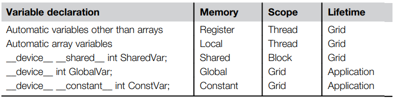
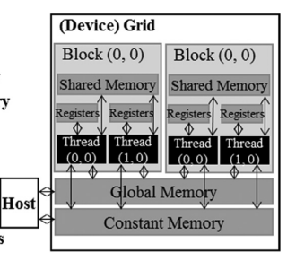
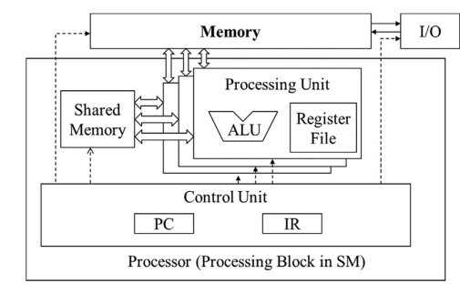

# 2.4 Device Global Memory and Data Transfer

As of today, most CUDA systems come with their own RAM called *device global memory* - but it is not the only device memory which can be accessed by programmers.

Before a kernel using RAM can be executed, the space needs to be allocated and transfer data from the host memory. Viceversa, after execution the transfer goes from device to host, and the space is freed. All of this is executed by the CUDA runtime system.

```c
cudaMalloc((void**) &pointer, n_bytes); 
//address of the pointer, allows any type
cudaFree(pointer);
cudaMemcpy(*dst, *src, n_bytes, direction);
/* direction can be: 
    cudaMemcpyHostToHost: 
    cudaMemcpyHostToDevice: 
    cudaMemcpyDeviceToHost: 
    cudaMemcpyDeviceToDevice: used for in-device memory transfer
*/
```

## Error Checking and Handling in CUDA
```c
cudaError_t err 5 cudaMalloc((void) &A_d, size);
    if (error! 5 cudaSuccess) {
    printf(“%s in %s at line %d\n”, cudaGetErrorString(err), __FILE__, __LINE__);
    exit(EXIT_FAILURE);
}
```

This way, if the system is out of device memory, the user will be
informed about the situation. This can save many hours of debugging time. 

## CUDA Memory Types
CUDA features the following memory types, each with its scope and lifetime:
- **global**: can be accessed by host and device Rs & Ws;
- **constant**: can also be accessed by host Rs and Ws - but supports only short-latency, high-bandwidth read access by the
device;
- **local**: each thread allocates its *non-shared* local memory in a part of the global memor. It hosts data that cannot be allocated in registers and elements of the call stack;
- **registers**: on-chip memory for very-high speed, high parallelism data access. Allocated to individual threads, usually hold frequently accessed private variables;
- **shared memory**: on-chip memory, allocated to *thread blocks*. Efficient sharing of input data and intermediate results;



### Scope and Lifetime
Single thread scope means each thread has a private version of the variable; all threads in a block and all threads of all grids are pretty self-explanatory.

Lifetime specifies the portion of execution when the variable can be used: either during the grid's or the entire application.

For it to be used during a grid execution, it must be declared within the kernel function body and will be available for use only by the kernel’s code. If the kernel is invoked several times, the value of the variable is not maintained across these invocations. Each invocation must initialize the variable in order to use it. 

On the other hand, if a variable’s lifetime is throughout the entire application, it must be declared outside of any function body. The contents of these variables are maintained
throughout the execution of the application and available to all kernels.

## Automatic Scalars and Arrays
Variables which are not arrays. Automatic scalar variables are declared in kernel, device functions are placed into registers. If a kernel function declares an automatic variable, it has scope Thread.

Automatic array variables are instead stored in the thread's local memory - which is off-chip, in the *global* one. This means longer access delays and potential congestions.

## Differences Between GPU and CPU Registers
The design objective of the GPUs is the ratio behind keeping the registers of all *scheduled* threads on the processing block in its register file. This allows for zero-overhead context-switching, as opposed to CPUs which save registers of outgoing thread to memory and load the incoming one's from it. 

The trade-off is found in the greater dimension of such register-files.

Additionally, GPU register files also need to be designed to support *dynamic resource partitioning*: an SM may provision few registers per thread and execute a large number of threads, or it my provision more registers per thread and execute fewer threads. CPUs support only the same, fixed-number of registers per thread.



## Differences between Register Types in GPUs
Compared to Von Neumann's architecture, a GPU can map its processor chip as the VN Processor; DRAM global memory to VN's external memory; registers to the Register File, which is in the PU. 

Typically, the aggregated access  bandwidth to registers files is more than two OOMs higher than the global memory's. Registers are ON-CHIP, and require fewer PTX instructions; operands are designed to work on them, and don't require a `load` operation.

Register memory access is also at least an OOM more energy efficient than a global memory access. On the other hand the number of registers available to each thread is quite limited in today’s GPUs.  Therefore we also need to avoid oversubscribing to this limited resource whenever possible

> [!quote] Takeaway: place operands in registers for speed, but remember to avoid oversubscribing.



### Shared Memory vs Registers
While Registers are embedded in the SM module, the shared memory is part of the on-chip memory space. It still requires a `ld` operation (a memory access), but it being on-chip means there's lower latency and higher throughput with respect to the global memory (*scratchpad memory*).

Any variable residing in the shared memory can be accessed by any thread of the same block efficiently and with high-bandwidth. This enables efficient multi-thread processing.

---

finisci, mancano due pagine